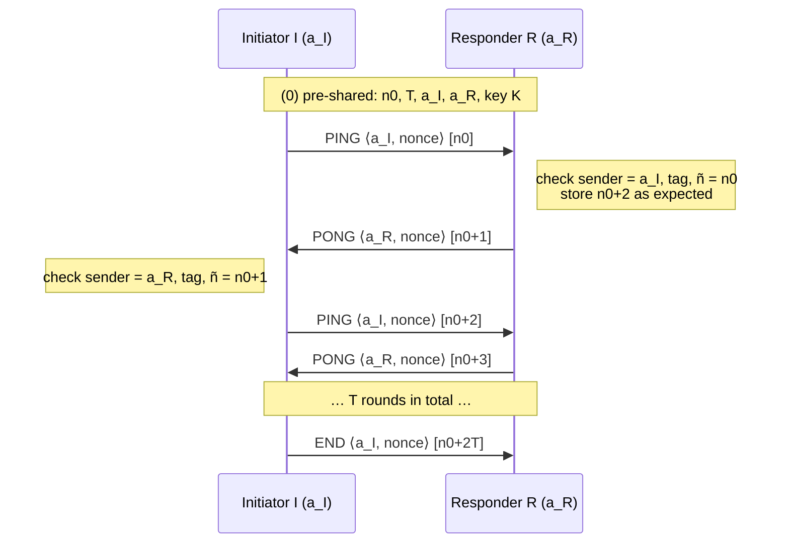
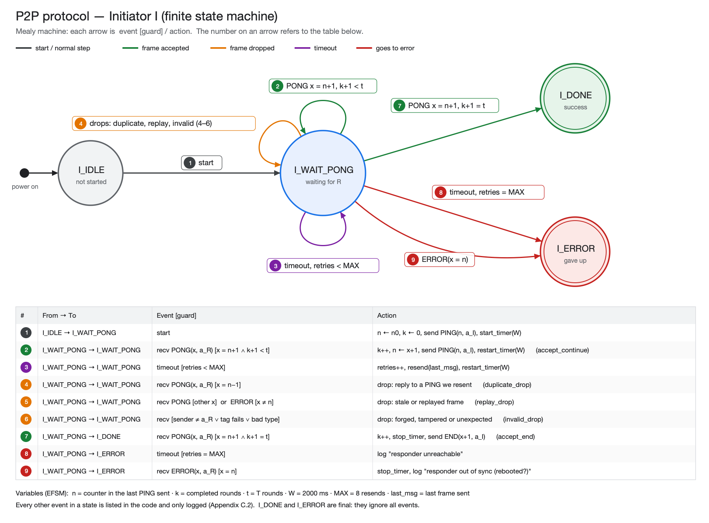
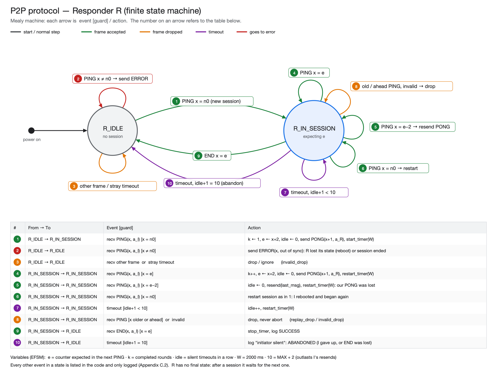

# Session 6 — Peer-to-peer MAC Frames Protocol (P2P)

| File | Task |
|---|---|
| `p2p_config.h` | Pre-shared constants (MACs, n0, T, key), timing, AEAD switch, fault injection |
| `p2p_unidirectional.c` | Task 1: I sends a frame every 2 s, R cycles the LED on receive |
| `p2p_fsm.h` / `p2p_fsm.c` | Tasks 2–7: the two state machines. Platform independent, so the same file runs on the boards and in the simulator |
| `p2p_protocol.c` | ESP32 side: radio frames, timer, LED, logging, `app_main` |
| `diagrams/fsm_initiator.png`, `diagrams/fsm_responder.png` | The two state diagrams (checkpoint 2) |
| `../../../Prosim/p2p/` | Laptop simulator running the same `p2p_fsm.c` (Appendix C, learning goal 4) |

## Getting started

1. In `main/CMakeLists.txt`, set `LAB_APP` to `"session6/p2p_unidirectional.c"` (task 1) or `"session6/p2p_protocol.c" "session6/p2p_fsm.c"` (the protocol).
2. Find the two boards' MAC addresses (see below) and put them into `P2P_INITIATOR_MAC` / `P2P_RESPONDER_MAC` in `p2p_config.h`.
3. Build and flash the **same** firmware to both boards. The role is chosen by MAC.
4. Start the monitor on both boards (two laptops is easiest). Either order works, because I resends until R answers.

> Note: the lab text says in step (2) that R "sends it addressed to R". That is a typo. R replies to **I**.

### Finding the MAC address of each board

Do this for each board, one at a time:

- **Read it with esptool, without flashing anything.** Plug in one board, open the ESP-IDF terminal (VS Code: *ESP-IDF: Open ESP-IDF Terminal*) and run:
  ```sh
  ls /dev/cu.usbmodem*                                   # find the port, e.g. /dev/cu.usbmodem101
  python -m esptool --port /dev/cu.usbmodem101 read-mac
  ```
  It prints `MAC: xx:xx:xx:xx:xx:xx`. On the ESP32-C6 the Wi-Fi station MAC used by the lab library is this base MAC.
- **From the flash log.** Every *Flash* prints the same `MAC: …` line near the top.
- **From our firmware.** At boot, `p2p_protocol.c` and `p2p_unidirectional.c` print `This board's MAC is …`. If the MAC is not in `p2p_config.h`, they also print `MAC not listed in p2p_config.h`.

Put a sticker on each board (D1 = initiator, D2 = responder) so you don't mix them up.

---

## Checkpoint 1: message sequence diagram of the ideal path



`⟨…⟩` is authenticated but readable (associated data). `[…]` is encrypted. Both are covered by the 16-byte Ascon tag.

**Frame payload** (after the 24-byte 802.11 header and the 8-byte LLC/SNAP header `AA AA 03 69 69 69 69 69`):

| Offset | Size | Field | AEAD mode |
|---|---|---|---|
| 0 | 1 | magic `0x6A` | associated data |
| 1 | 1 | type: 1 PING, 2 PONG, 3 END, 4 ERROR | associated data |
| 2 | 6 | sender identity (MAC) | associated data |
| 8 | 16 | nonce (random per frame; zeros in plaintext mode) | associated data |
| 24 | 4 | counter n, big-endian (network byte order) | encrypted |
| 28 | 1 | error code (0 = none, 1 = out of sync) | encrypted |
| 29 | 16 | Ascon tag | AEAD only |

---

## Checkpoint 2: FSMs and the failures they handle

The design follows Appendix C (revised manual, 24 Sept 2026):

- **Mealy machine (transition-assigned action):** every arrow is `event [guard] / action`. The work happens on the transition, never inside a state.
- **Extended FSM (EFSM):** counters and retries live in variables (the `p2p_party_t` struct) instead of extra states:

| Variable (Appendix C name) | In the code | Meaning |
|---|---|---|
| current state | `p->i_state`, `p->r_state` | which node of the graph we are in |
| n (I), e (R) | `p->n` | I: counter in the last PING sent. R: counter expected in the next PING |
| k | `p->rounds` | completed exchanges |
| t | `P2P_T` | rounds to run |
| W | `P2P_TIMEOUT_MS` (2000 ms) | waiting period of the timer |
| retries / idle | `p->retries` | I: resends of the current PING. R: consecutive silent timeouts |
| last_msg | `p->last_tx` | last frame sent, kept so a resend is identical |

- **Guards (Figure 7 style):** a received frame is first classified (identity, integrity, type, counter), then exactly one guarded branch fires. In C that is an `if / else if` chain inside `case EV_FRAME:`, as in Listing 2. Figure 6 does the same with a transient HANDLE_FRAME state. The log messages use its category names: `accept_continue`, `accept_end`, `duplicate_drop`, `replay_drop`, `invalid_drop`.

### Initiator



### Responder



In the code (`p2p_fsm.c`) the outer `switch` is on the state and the inner `switch` is on the event (`EV_START`, `EV_FRAME`, `EV_TIMEOUT`), as in Appendix C, Listing 1. **Every event is listed in every state.** Events that should not happen in a state (for example START while running, or a stray timeout) get a log message, so none are forgotten (C.2).

### Deviations from the ideal path

| Event | Detected by | Handling |
|---|---|---|
| R not powered or not ready | I timeout | I resends every 2 s, up to 8 times, then goes to `I_ERROR` "responder unreachable" |
| PING lost | I timeout | I resends the **identical** frame |
| PONG lost | I timeout; R sees `e−2` | R resends its last PONG. It does not count the round twice |
| Duplicate PONG (reply to a resent PING) | counter `n−1` | Ignored (`duplicate_drop`) |
| Frame from another device, ACKs, beacons | frame type, SNAP OUI, magic | Silently ignored |
| Wrong sender identity (spoofed or other board) | `addr2` and the sender field must both equal the peer | `invalid_drop` |
| Tampered or forged frame (AEAD on) | tag verification | `invalid_drop`. The sender's timeout causes a resend |
| Old frame replayed within the session | counter is older than expected | `replay_drop`. R **never aborts** on a stray PING, so a replay cannot kill the session |
| I reboots or its battery dies mid-session | R receives PING(n0) | R restarts the session |
| I silent for good | R timeout | R abandons the session after (`P2P_MAX_RETRIES` + 2) × W = 20 s. That is longer than I keeps retrying (18 s), so R never gives up first |
| R reboots mid-session | idle R receives PING(n ≠ n0) | R sends ERROR(out of sync), and I goes to `I_ERROR` immediately instead of waiting for timeouts |
| Old ERROR replayed | ERROR echoes the counter it refers to | I accepts ERROR only for its current `n` |
| END lost | R timeout | R abandons after 20 s and logs it. I has already finished. This is the Two Generals problem: whoever sends the last message never knows whether it arrived |
| Unexpected message type | guard chain | `invalid_drop` |

A resent frame is byte-for-byte identical, so under AEAD the same nonce is reused with the **same** plaintext. That produces an identical ciphertext and leaks nothing new. Each new message gets a fresh random nonce.

### No deadlock, no livelock (C.3.1)

- **Deadlock** (both sides waiting for each other forever) cannot happen. Every waiting state has a timer: I resends and finally gives up, and R abandons a silent session.
- **Livelock** (looping without progress) is bounded. I resends at most `P2P_MAX_RETRIES` times, and a duplicate never advances the counters.
- **Checked in the simulator:** 50,000+ random runs with loss, duplicates, bit errors and replays. No run ended in deadlock, livelock or an inconsistent state (see below).

### Why MAC-layer ARQ is not enough (C.3.2)

The 802.11 hardware already ACKs unicast frames and retransmits when no ACK arrives. The protocol still needs its own timeouts, resends and duplicate handling:

1. **Retry limit reached.** After the MAC retries (about 6 for short frames), the frame is simply gone, and nothing tells our program. Only our protocol timeout notices.
2. **Lost ACK.** The data frame arrived but its ACK was lost, so the MAC sends it again. The receiver can get the same frame twice, which is why R treats `x = e−2` as a duplicate and does not count it twice.
3. **The peer is dead** (battery, out of range). No MAC mechanism resolves this, but our timeout plus `I_ERROR` or abandoning the session does.
4. **An attacker can send a fake ACK** while jamming or blocking the real frame. The sender's MAC believes the frame was delivered, and only the protocol-level reply proves that it was.
5. **ARQ gives reliability, not security.** The checksum (FCS) is not keyed, so anyone can compute a valid FCS for a forged or replayed frame. Integrity against an attacker comes from the Ascon tag and the counter checks.

In Wireshark, look at the *Retry* bit in the Frame Control field to see MAC retransmissions.

### Tested in the simulator before flashing

`Prosim/p2p` runs the same `p2p_fsm.c` on the laptop over a simulated channel with loss, duplicates, bit errors, an attacker replaying recorded frames, R switched on late, and R rebooting. It found and fixed three problems:

1. R gave up (after 10 s) while I was still resending (until 18 s), so the session died with an ERROR. R's patience is now 20 s.
2. A duplicate PING did not reset R's silence counter.
3. A replayed old PING made R abort the session, a cheap denial-of-service attack. R now drops it.

See `Prosim/p2p/README.md` for the commands and the numbers.

---

## Checkpoint 3: code walk-through

**`p2p_fsm.c`** holds the protocol and is shared by the ESP32 and the simulator:
- `p2p_encode` / `p2p_decode` build and verify the payload above: magic, sender identity, then `ascon_aead_encrypt` / `ascon_aead_decrypt`.
- `radio_send` sends a frame, with the optional simulated loss and corruption for checkpoint 4. `resend_last` repeats the identical frame.
- `initiator_fsm` / `responder_fsm` are the two state machines: outer switch on the state, inner switch on the event, then the guard chain for frames.
- `p2p_handle_event` is the single entry point: it decodes a frame, then calls the right FSM for the party's role.
- The state machines reach the outside world only through seven `plat_*` functions: send, timer start/stop, LED, random bytes, clock, delay and log.

**`p2p_protocol.c`** is the ESP32 side:
- The `plat_*` functions map to the lab library and ESP-IDF:
  - send → `transmit()`
  - timer → `start_timeout_timer()` / `xTimerStop()`
  - LED → `cycle_light()`
  - random → `esp_fill_random()` (hardware TRNG)
  - clock → `esp_timer_get_time()`
- `fsm_event_dispatcher` is a FreeRTOS task that takes events from `fsm_event_queue` (filled by the library's radio callback and timeout timer). It checks that a frame is an 802.11 data frame with our SNAP header (the radio also delivers 14-byte ACKs), passes it to `p2p_handle_event`, and frees the frame.
- Events use the library's own `event_t` layout (`uint8_t event`: 0 = timeout, 1 = frame), so queue items always match what the library writes.
- `app_main` calls `setup()`, picks the role from the MAC, and on the initiator queues the START event.

---

## Checkpoint 4: run while inflicting bad events

Change the knobs in `p2p_config.h`, rebuild, and flash **both** boards each time. Watch both monitors, and check the SUMMARY block printed at the end. The same scenarios can be shown in the simulator first (`Prosim/p2p`).

| Demo | How | What to show |
|---|---|---|
| Ideal path | defaults (T = 5) | 5 rounds, LED changes colour on each frame, END, SUMMARY `SUCCESS` |
| Lost frames | `P2P_SIMULATE_LOSS_EVERY 3` | `[sim] … lost` → `TIMEOUT: resending` on I, `duplicate: … resending last PONG` on R, still `SUCCESS` |
| Tampering, AEAD on | `P2P_SIMULATE_CORRUPT_EVERY 4` | R logs `invalid_drop: AEAD tag verification failed`, I times out and resends, still `SUCCESS` |
| Tampering, AEAD off | the same, plus `P2P_USE_AEAD 0` | The flipped bit changes the counter, so R drops it (`replay_drop` / `invalid_drop`) and I resends. Random errors are caught by the counter check, but a frame an attacker **writes** with the correct next counter would be accepted. Only the tag stops that |
| R not ready | start I, wait about 5 s, then start R | I resends until R answers |
| R reboots mid-run | press RESET on R during the run | R sends `ERROR` → I goes to `I_ERROR` "responder is out of sync" |
| I reboots mid-run | press RESET on I | R logs "initiator restarted the session from n0" and continues |
| R gone for good | unplug R | I goes to `I_ERROR` after 8 resends |
| Stress | `P2P_T 10000`, `P2P_ROUND_DELAY_MS 0` | Progress every 1000 rounds. Compare rounds/s and resends in SUMMARY |
| Distance | move the boards apart (task 6) | Resends and duplicates rise as RSSI drops toward the noise floor |

---

## Checkpoint 5: Wireshark, plaintext vs. encrypted

Use a third board as the sniffer (Appendix B): set `LAB_APP` to `"tools/sniffer.c"` and call `setup_target(TIMEOUT_MS, "<MAC of I>")`. Capture one run with `P2P_USE_AEAD 0` and one with `1`.

What to point out in the payload after `AA AA 03 69 69 69 69 69`:

- **Plaintext:** `6A 01 <a_I> 00…00 3A 7F 12 C4 00`. The counter n0 = `3A7F12C4` is readable, and the next PONG carries `3A7F12C5`. Anyone can read, predict and forge the next message.
- **AEAD:** magic, type and sender are still readable, because associated data is authenticated but not encrypted. The nonce is random for every frame. The 5 body bytes look random and change even when the same counter pattern repeats, and a 16-byte tag follows.
- **Extra (reordering and replay):** re-sending a captured frame is dropped (`replay_drop`) or answered as a duplicate. It never advances the protocol.

---

## Security analysis (task 3, "clever intentional incidents")

**Plaintext mode.** The only authentication is the MAC address, which is trivially spoofable (Session 5). An attacker in radio range can read every counter, inject the correct next PING or PONG, or send a forged ERROR to abort a session. Checking identities only stops accidents.

**AEAD mode (task 7) adds:**
- confidentiality of the counter
- integrity and authenticity of the type, sender, nonce and counter, so forged and modified frames are dropped
- in-session replay protection from the strict counter window. A replay is dropped and never aborts the session

**Remaining weaknesses** (good discussion points, and the motivation for Session 7):
1. **Cross-session replay.** n0 and K are static, so a recorded session can be replayed to R message by message and R will accept it. The fix is a fresh random challenge per session and a session key derived from it (Session 7's protocol).
2. **Reset DoS.** Replaying a recorded PING(n0) makes R restart its session. In the simulator this caused 42 of 43 checked failures under a replay attack. The same fix applies.
3. **Metadata leakage.** Message type, sender and timing are visible, which allows traffic analysis.
4. **Jamming and flooding** cannot be prevented by cryptography (Session 10).
5. **Hard-coded key** in the firmware: anyone who reads the flash of one board can impersonate both.
